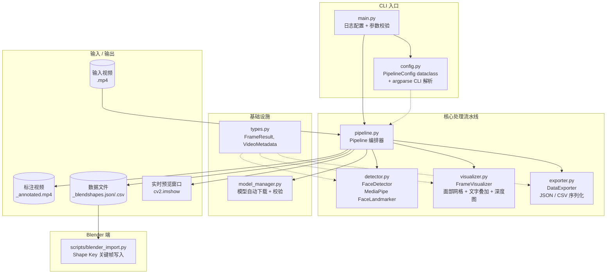
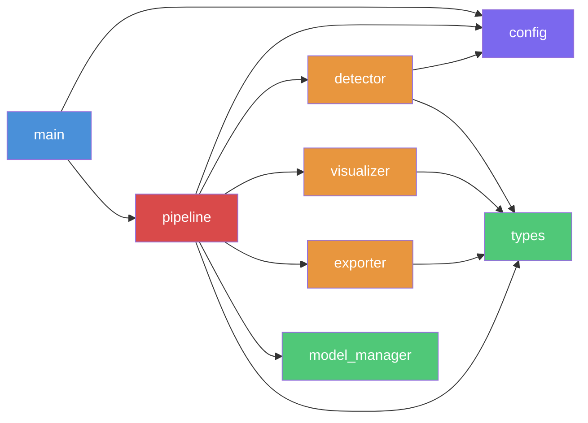

# Expression Detect - 项目技术文档

> 人脸表情检测系统：输入人脸视频 → 检测 52 个 ARKit blendshapes + 468 个 3D 面部关键点 → 输出标注视频 + 数据文件供 Blender 导入。

---

## 1. 项目概述与设计思路

### 核心目标

将视频中的面部表情转化为可量化的数据，用于驱动 Blender 中的角色面部动画。整个流程无需 GPU，在 CPU 上即可达到 30+ FPS 实时处理。

### 技术选型理由

| 选型 | 理由 |
|------|------|
| **MediaPipe FaceLandmarker** | CPU 实时推理（TFLite XNNPACK），原生输出 ARKit 兼容的 52 个 blendshape，无需额外训练 |
| **OpenCV** | 成熟的视频 I/O + 帧级绘制能力，未来可通过 `cv2.cuda` 变体加速 |
| **纯 Python + uv** | 快速原型，依赖管理简洁，uv 比 pip 快 10-100x |

### 设计原则

- **模块化单一职责**：每个模块只做一件事（检测 / 可视化 / 导出），通过 `Pipeline` 统一编排
- **数据驱动**：所有模块间通过 `FrameResult` 数据结构传递，无隐式状态
- **首次运行零配置**：模型自动下载，输出路径自动推导，开箱即用
- **实时反馈**：默认开启预览窗口，可按 `q` 随时中断

---

## 2. 架构总览图




---

## 3. 模块依赖关系图





**依赖层次**（从上到下）：
1. **入口层** — `main.py`：仅依赖 `config` 和 `pipeline`
2. **编排层** — `pipeline.py`：依赖所有功能模块，是唯一的"胖依赖"节点
3. **功能层** — `detector`、`visualizer`、`exporter`：彼此独立，各自依赖 `types`
4. **基础层** — `types.py`、`model_manager.py`：零内部依赖

---

## 4. 逐帧处理时序图

```mermaid
sequenceDiagram
    participant User
    participant Main as main.py
    participant Cfg as config.py
    participant Pipe as Pipeline
    participant MM as ModelManager
    participant Det as FaceDetector
    participant Vis as FrameVisualizer
    participant Exp as DataExporter
    participant CV as OpenCV

    User->>Main: uv run python -m src.main video.mp4
    Main->>Cfg: parse_args()
    Cfg-->>Main: PipelineConfig

    Main->>Pipe: Pipeline(config).run()
    Pipe->>MM: ensure_model(path)
    MM-->>Pipe: model ready

    Pipe->>CV: VideoCapture(video)
    CV-->>Pipe: VideoMetadata (fps, w, h, frames)

    Pipe->>Exp: set_metadata(metadata)
    Pipe->>CV: VideoWriter(output_path)

    rect rgb(40, 40, 60)
    note over Pipe,CV: 逐帧循环
    loop 每一帧
        Pipe->>CV: cap.read()
        CV-->>Pipe: bgr_frame

        Pipe->>Det: detect_frame(bgr, idx, ts_ms)
        Note over Det: BGR→RGB 转换<br/>mp.Image 封装<br/>detect_for_video()
        Det-->>Pipe: FrameResult

        Pipe->>Exp: add_frame(result)

        Pipe->>Vis: annotate_frame(bgr, result)
        Note over Vis: 绘制面部网格<br/>blendshape 文字叠加<br/>深度图侧边栏
        Vis-->>Pipe: annotated_frame

        Pipe->>CV: writer.write(annotated)
        Pipe->>CV: imshow(annotated)
    end
    end

    Pipe->>Exp: save(data_path)
    Note over Exp: JSON 或 CSV 序列化
    Pipe->>CV: release() + destroyAllWindows()
    Pipe-->>Main: 完成
```




---

## 5. 数据流与核心数据结构

### 数据流向

```
输入视频 (.mp4)
    │
    ▼
 cv2.VideoCapture ──→ BGR numpy 帧 (H×W×3, uint8)
    │
    ▼
 FaceDetector.detect_frame()
    │  BGR→RGB → mp.Image → FaceLandmarker.detect_for_video()
    │
    ▼
 FrameResult ─────────────────────┐
    │                              │
    ▼                              ▼
 FrameVisualizer              DataExporter
    │  绘制网格 + 叠加文字        │  累积所有帧
    │                              │
    ▼                              ▼
 标注视频 (_annotated.mp4)    数据文件 (.json / .csv)
    +                              │
 实时预览窗口                      ▼
                              Blender 导入
```

### FrameResult — 核心数据载体

```python
# src/types.py
@dataclass
class FrameResult:
    frame_index: int                              # 帧序号 (0-based)
    timestamp_ms: int                             # 时间戳 (毫秒，单调递增)
    landmarks: list[list[dict[str, float]]]       # [face][468]{x,y,z} 归一化 0~1
    blendshapes: list[dict[str, float]]           # [face]{name: score} 52 个 ARKit + _neutral
    transformation_matrix: list[np.ndarray|None]  # [face] 4×4 面部姿态矩阵
```

每帧的 `FrameResult` 包含**多人脸**支持的三层嵌套结构：

| 字段 | 维度 | 说明 |
|------|------|------|
| `landmarks` | `[N_faces][468][3]` | 每个关键点有 `x` (横向), `y` (纵向), `z` (深度) — 见下方详解 |
| `blendshapes` | `[N_faces][52+1]` | 52 个 ARKit 标准名 + `_neutral`（基础表情），score ∈ [0, 1] |
| `transformation_matrix` | `[N_faces][4×4]` | 刚体变换矩阵，包含头部旋转 + 平移 |

#### 468 个 3D Landmarks 的坐标含义

这 468 个带深度信息的 3D 关键点**全部由 MediaPipe FaceLandmarker 模型一次推理直接输出**，项目代码不做任何额外的深度计算。MediaPipe 的神经网络在合成 3D 人脸数据集上训练，具备从单张 2D 图像推断面部三维几何结构的能力（本质是单目深度估计 + 面部结构先验的结合）。

各坐标轴含义：

| 坐标 | 值域 | 含义 |
|------|------|------|
| `x` | [0, 1] | 横向位置，归一化到图像宽度 |
| `y` | [0, 1] | 纵向位置，归一化到图像高度 |
| `z` | 约 [-0.1, 0.1] | 深度，以面部中心为原点。**值越小越靠近摄像头**，量级与 x 近似 |

### VideoMetadata

```python
@dataclass
class VideoMetadata:
    width: int           # 帧宽度 (像素)
    height: int          # 帧高度 (像素)
    fps: float           # 帧率
    total_frames: int    # 总帧数
```

### PipelineConfig — 配置传递链

```python
@dataclass
class PipelineConfig:
    # I/O
    input_video: Path
    output_video: Path | None     # 不指定则自动推导
    output_data: Path | None      # 不指定则自动推导
    model_path: Path              # 默认 models/...task

    # 检测参数
    num_faces: int = 1
    min_detection_confidence: float = 0.5
    min_presence_confidence: float = 0.5
    min_tracking_confidence: float = 0.5

    # 可视化开关
    draw_tesselation: bool = True
    draw_contours: bool = True
    draw_irises: bool = True
    show_blendshapes: bool = True
    show_depth_map: bool = False
    top_n_blendshapes: int = 10

    # 导出 & 预览
    export_format: str = "json"
    show_preview: bool = True
```

配置从 CLI 一次解析，向下传递：`main → Pipeline → FaceDetector / FrameVisualizer / DataExporter`。各模块只读取自己需要的字段。

---

## 6. 各模块关键函数详解

### 6.1 main.py — 入口

| 函数 | 作用 |
|------|------|
| `main()` | 配置 logging，调用 `parse_args()` 获取配置，校验输入文件存在性，创建 `Pipeline` 并执行 |

极简入口，所有复杂逻辑委托给其他模块。

### 6.2 config.py — 配置系统

| 函数 / 类 | 作用 |
|-----------|------|
| `PipelineConfig` | 所有配置项的 dataclass 容器，提供合理默认值 |
| `parse_args()` | 构建 argparse CLI，支持正向参数 (`--show-depth-map`) 和负向开关 (`--no-tesselation`, `--no-preview`)，返回 `PipelineConfig` |

**设计要点**：默认启用的功能用 `--no-xxx` 关闭（contours、tesselation、preview），默认关闭的用 `--show-xxx` 开启（depth-map）。

### 6.3 model_manager.py — 模型管理

| 函数 | 作用 |
|------|------|
| `ensure_model(path)` | 检查模型文件是否存在且 ≥ 3.5MB，缺失则自动下载 |
| `_download(dest)` | 使用 `urllib.request.urlretrieve` 下载，带进度回调显示百分比，下载后校验大小，失败则清理 |

**防护机制**：下载失败或文件过小时自动 `unlink()` 避免残留坏文件。

### 6.4 detector.py — 面部检测

| 函数 | 作用 |
|------|------|
| `__enter__` / `__exit__` | 上下文管理器，创建和关闭 `FaceLandmarker` 实例 |
| `detect_frame(bgr, idx, ts_ms)` | 单帧检测：BGR→RGB、封装 `mp.Image`、调用 `detect_for_video()`、转换结果 |
| `_convert_result(result, idx, ts_ms)` | 将 MediaPipe 原始结果转为 `FrameResult`：提取 landmarks (468×3)、blendshapes (52)、transformation matrix (4×4) |

**关键约束**：
- `timestamp_ms` **必须单调递增**，否则 MediaPipe VIDEO 模式会报错
- 需要 BGR → RGB 转换，因为 OpenCV 读取的是 BGR 而 MediaPipe 期望 RGB
- `FaceLandmarkerOptions` 中 `output_face_blendshapes=True` 和 `output_facial_transformation_matrixes=True` 必须显式开启

### 6.5 visualizer.py — 帧可视化

| 函数 | 作用 |
|------|------|
| `annotate_frame(bgr, result)` | 主入口：在帧副本上绘制所有可视化层 |
| `_to_normalized_landmarks(landmarks)` | 将 `list[dict]` 转为 `list[NormalizedLandmark]`，适配 `draw_landmarks()` 新 API |
| `_draw_blendshape_overlay(frame, bs)` | 左上角绘制 Top-N blendshape 分数，黑底绿字 |
| `_draw_depth_sidebar(frame, landmarks)` | 右侧拼接深度图：将 MediaPipe 直接输出的 landmark Z 坐标可视化为伪彩色图 |

**深度图侧边栏原理**：`_draw_depth_sidebar()` 不做任何深度估计，它仅将 MediaPipe 模型已输出的 468 个 landmark Z 坐标做 min-max 归一化后，映射到 0-255 灰度值，再用 OpenCV `COLORMAP_INFERNO` 着色。近处（Z 值小）显示为亮色，远处为暗色。背景区域（无 landmark 覆盖）保持黑色。

**可视化层叠顺序**：
1. Tesselation 网格（半透明灰色线条）
2. Contours 轮廓（彩色线条，眉/眼/嘴/脸颊分色）
3. Irises 虹膜（小圆圈）
4. Blendshape 文字叠加
5. 深度图侧边栏（可选，会增加输出宽度 25%）

### 6.6 exporter.py — 数据导出

| 函数 | 作用 |
|------|------|
| `set_metadata(metadata)` | 存储视频元数据，写入 JSON 头部 |
| `add_frame(result)` | 累积每帧结果到内存 |
| `save(path)` | 根据格式选择 `_save_json()` 或 `_save_csv()` |
| `_save_json(path)` | 完整导出：metadata + blendshape_names + frames[]（含 landmarks_3d、transformation_matrix） |
| `_save_csv(path)` | 简洁导出：每行一帧，列 = `frame, timestamp_ms, 52个blendshape值`，仅首张人脸 |

**52 个 ARKit blendshape 名称**定义为模块级常量 `ARKIT_BLENDSHAPE_NAMES`，按字母序排列，确保 CSV 列顺序稳定。

### 6.7 pipeline.py — 编排器

| 函数 | 作用 |
|------|------|
| `run()` | 主流程：模型就绪 → 打开视频 → 初始化各模块 → 逐帧循环(检测→导出→可视化→写入) → 保存数据 → 清理资源 |
| `_extract_metadata(cap)` | 从 `VideoCapture` 提取分辨率、帧率、总帧数 |
| `_resolve_output_path(kind)` | 自动推导输出路径：`output/{stem}_annotated.mp4` 或 `output/{stem}_blendshapes.{json,csv}` |

**preview 交互**：`cv2.waitKey(1)` 监听 `q` 键，支持提前中断。中断时已处理的帧仍会完整导出。

---

## 7. MediaPipe 0.10.32 API 要点（踩坑记录）

### mp.solutions 已移除

MediaPipe 0.10.32 **完全删除了 `mp.solutions` 模块**，原有的导入方式全部失效：

```python
# 旧 API（已不可用）
import mediapipe as mp
mp_drawing = mp.solutions.drawing_utils
mp_face_mesh = mp.solutions.face_mesh
```

### 新 API 导入路径

```python
# Task API — 检测
from mediapipe.tasks.python.vision import FaceLandmarker, FaceLandmarkerOptions
from mediapipe.tasks.python import BaseOptions
from mediapipe.tasks.python.vision import RunningMode

# 绘图
from mediapipe.tasks.python.vision import drawing_utils, drawing_styles
from mediapipe.tasks.python.vision.face_landmarker import FaceLandmarksConnections
from mediapipe.tasks.python.components.containers.landmark import NormalizedLandmark
```

### draw_landmarks() 签名变更

| 参数 | 旧 API | 新 API |
|------|--------|--------|
| `landmark_list` | `NormalizedLandmarkList` (protobuf) | `list[NormalizedLandmark]` (Python 对象) |
| `connections` | `FACEMESH_TESSELATION` 等 | `FaceLandmarksConnections.FACE_LANDMARKS_TESSELATION` 等 |

因此 `_convert_result()` 中先转为 `dict`，`_to_normalized_landmarks()` 再转为 `NormalizedLandmark` 列表，两步适配。

### 连接集名称映射

| 旧名称 | 新名称 |
|--------|--------|
| `FACEMESH_TESSELATION` | `FaceLandmarksConnections.FACE_LANDMARKS_TESSELATION` |
| `FACEMESH_CONTOURS` | `FaceLandmarksConnections.FACE_LANDMARKS_CONTOURS` |
| `FACEMESH_IRISES` | **不存在** — 需手动拼接 `FACE_LANDMARKS_LEFT_IRIS + FACE_LANDMARKS_RIGHT_IRIS` |

### 3D Landmarks 与深度信息

FaceLandmarker 模型**单次推理同时输出** 468 个 3D 关键点（含深度 Z）、52 个 blendshape 系数、和 4×4 面部变换矩阵。深度信息不需要双目摄像头或深度传感器——模型在合成 3D 人脸数据上训练，通过单目图像即可推断出面部表面的相对深度。Z 坐标以面部中心为零点，鼻尖 Z 值最小（最靠近摄像头），耳朵附近 Z 值最大。

这意味着项目中的面部网格绘制（tesselation/contours）和深度图侧边栏，**数据来源完全相同**——都是 `detect_for_video()` 返回的 `face_landmarks` 列表，只是可视化方式不同：网格用 x, y 连线，深度图用 z 着色。

### VIDEO 模式注意事项

- `running_mode` 必须设为 `RunningMode.VIDEO`（非 IMAGE 或 LIVE_STREAM）
- `detect_for_video(image, timestamp_ms)` 的 `timestamp_ms` **必须严格单调递增**，重复或回退会抛异常
- blendshape 输出默认关闭，需在 Options 中显式 `output_face_blendshapes=True`
- transformation matrix 同理：`output_facial_transformation_matrixes=True`（注意拼写是 `matrixes` 不是 `matrices`）

---

## 8. 输出数据格式与 Blender 对接

### JSON 格式（完整数据）

```json
{
  "metadata": {
    "fps": 30.0,
    "total_frames": 900,
    "width": 1920,
    "height": 1080
  },
  "blendshape_names": ["browDownLeft", "browDownRight", ...],
  "frames": [
    {
      "frame_index": 0,
      "timestamp_ms": 0,
      "faces": [
        {
          "blendshapes": {
            "browDownLeft": 0.012345,
            "jawOpen": 0.543210,
            ...
          },
          "landmarks_3d": [
            {"x": 0.456, "y": 0.789, "z": 0.012},
            ...  // 468 个
          ],
          "transformation_matrix": [
            [1.0, 0.0, 0.0, 0.0],
            [0.0, 1.0, 0.0, 0.0],
            [0.0, 0.0, 1.0, 0.0],
            [0.0, 0.0, 0.0, 1.0]
          ]
        }
      ]
    }
  ]
}
```

### CSV 格式（简洁，Blender 插件兼容）

```
frame,timestamp_ms,browDownLeft,browDownRight,...,tongueOut
0,0,0.012345,0.006789,...,0.000012
1,33,0.013456,0.007890,...,0.000015
```

- 每行一帧，仅首张人脸
- 52 列 blendshape 按 `ARKIT_BLENDSHAPE_NAMES` 固定顺序
- 兼容 Blender Faceit / ShapeKeyGen 插件直接导入

### Blender 导入流程

`scripts/blender_import.py` 是一个在 **Blender 脚本编辑器**中运行的独立脚本：

1. 加载 JSON 数据文件
2. 设置场景帧率和总帧数
3. 遍历每帧数据，对每个 blendshape：
   - 在 `shape_keys.key_blocks[name]` 上设置 `value`
   - 调用 `keyframe_insert(data_path="value", frame=frame_num)` 插入关键帧
4. 未匹配的 blendshape 名称会被跳过并汇报

**前置要求**：目标 Mesh 必须已有 ARKit 命名的 Shape Keys。推荐使用 [ARKitBlendshapeHelper](https://github.com/elijah-atkins/ARKitBlendshapeHelper) 插件一键创建。

### UE5 MetaHuman 对接

#### 兼容性

MetaHuman 的面部骨骼系统**原生基于 ARKit 52 blendshapes**，与本项目输出的 blendshape 集合 1:1 对应。这意味着数据语义完全兼容，无需重定向或额外映射。

UE 5.7 进一步改进了对接体验：
- **LiveLinkFaceImporter 插件**：直接导入 Live Link Face 格式 CSV，一键生成 Level Sequence 面部动画
- **Rig Mapper**：简化 ARKit 动画到 MetaHuman 的重定向流程
- **Morph Target Viewer**：可视化查看和调试所有 blendshape 权重

#### Live Link Face CSV 格式

UE5 的 LiveLinkFaceImporter 插件期望的 CSV 格式（由 Apple Live Link Face app 定义）：

```
Timecode,BlendShapeCount,EyeBlinkLeft,EyeBlinkRight,...,TongueOut,HeadYaw,HeadPitch,HeadRoll,LeftEyeYaw,LeftEyePitch,RightEyeYaw,RightEyePitch
00:00:00:00.000,61,0.012345,0.006789,...,0.000012,1.234,-0.567,0.089,...
00:00:00:33.001,61,0.013456,0.007890,...,0.000015,1.345,-0.678,0.090,...
```

#### 当前格式差异

| 维度 | 本项目 CSV | Live Link Face CSV |
|------|-----------|-------------------|
| 时间列 | `frame` (int) + `timestamp_ms` (int) | `Timecode` (`HH:MM:SS:MS.FFF`) |
| 计数列 | 无 | `BlendShapeCount`（固定 61） |
| 命名风格 | camelCase (`eyeBlinkLeft`) | PascalCase (`EyeBlinkLeft`) |
| 头部旋转 | 未导出（在 JSON 的 `transformation_matrix` 中） | `HeadYaw`, `HeadPitch`, `HeadRoll` (Euler 角) |
| 眼球注视 | 未导出（可从 iris landmarks 计算） | `LeftEyeYaw/Pitch`, `RightEyeYaw/Pitch` |
| 总列数 | 54（frame + ts + 52 bs） | 63（timecode + count + 52 bs + head 3 + eyes 6） |

#### 适配路径（未来实现）

实现 `--export-format livelink` 的技术要点：

1. **名称映射**：`camelCase → PascalCase`，直接首字母大写（`eyeBlinkLeft` → `EyeBlinkLeft`）
2. **Timecode 生成**：从 `timestamp_ms` 转换为 `HH:MM:SS:MS.FFF` 格式
3. **头部旋转**：从 `transformation_matrix` (4×4) 提取旋转子矩阵，分解为 Euler 角（Yaw/Pitch/Roll）
4. **眼球注视**：从 468 个 landmarks 中的虹膜关键点（左虹膜 #468-#472、右虹膜 #473-#477）计算注视方向
5. **BlendShapeCount**：固定写入 61（52 blendshapes + 3 head + 6 eyes）

数据源全部已具备（blendshapes、transformation_matrix、iris landmarks），只需格式转换层。

#### UE5 导入步骤

1. 在 UE5 中启用 **LiveLinkFaceImporter** 插件（Edit → Plugins，搜索 "Live Link Face Importer"）
2. 重启编辑器
3. Content Browser → Import → 选择导出的 `.csv` 文件
4. 自动生成同名 **Level Sequence** 资产
5. 双击打开 Sequencer，可看到所有 blendshape 的关键帧曲线
6. 将 MetaHuman 角色拖入 Level Sequence，面部动画自动驱动

---

## 附录：快速命令参考

```bash
# 基础运行（带预览）
uv run python -m src.main video.mp4

# 无预览 headless 模式
uv run python -m src.main video.mp4 --no-preview

# CSV 导出 + 深度图 + 检测 2 张脸
uv run python -m src.main video.mp4 --export-format csv --show-depth-map --num-faces 2

# 自定义输出路径
uv run python -m src.main video.mp4 -o result.mp4 -d result.json

# 极简可视化（仅轮廓，无网格/虹膜/文字）
uv run python -m src.main video.mp4 --no-tesselation --no-irises --no-blendshapes
```
